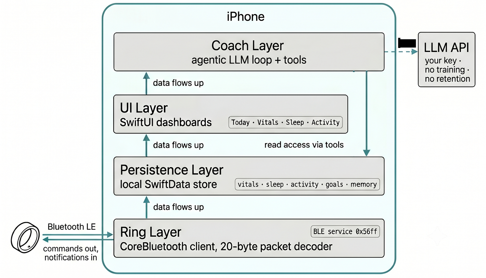
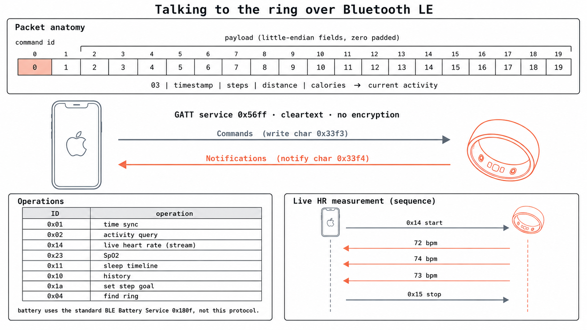
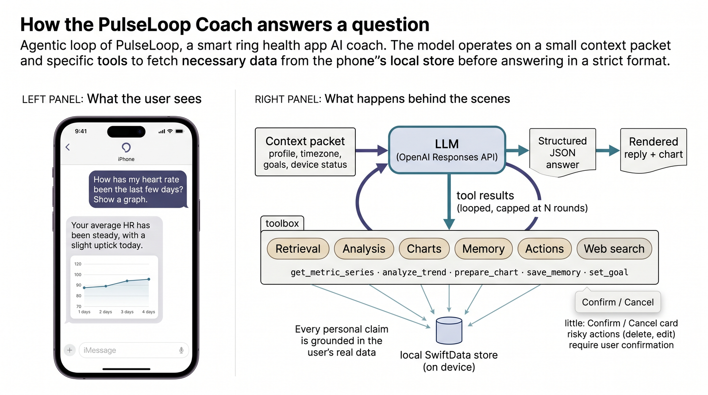

# Architecture

PulseLoop is built **local-first**: data flows up from the ring into local
storage on your phone, the coach reads sideways through tools, and the only thing
that ever leaves the device is a coach question you explicitly choose to ask.

## System architecture

Four layers on the phone. Data flows up from the ring into local storage; the
coach reads sideways through tools, and the only thing that leaves the device is a
coach question you choose to ask.



## The ring link

One custom BLE service, fixed 20-byte cleartext packets, commands out and
notifications back.



## The AI coach

An agentic loop that calls tools to read your local data, then answers in a
structured format. Every answer is grounded in your actual ring data.



## iOS project layout

```text
PulseLoop/
├─ RingProtocol/      BLE client + packet decoding for the ring
├─ Models/            SwiftData models (vitals, sleep, activity, coach)
├─ Services/          Sync, workouts, GPS, derived summaries
├─ Coach/             The LLM coach: orchestration, tools, prompts, notifications
│  ├─ Orchestration/  Agentic turn loop, tool execution, fallbacks
│  ├─ Tools/          Retrieval, analysis, charts, memory, web search, actions
│  ├─ OpenAI/         Responses API client
│  ├─ Gemini/         Google Gemini client
│  └─ Notifications/  Daily AI check-ins
├─ Views/             SwiftUI screens (Today, Vitals, Sleep, Activity, Coach)
└─ DesignSystem/      Charts, components, theming

PulseLoopLiveActivity/  Live Activity + Dynamic Island widget
PulseLoopTests/         Unit tests
```

## Same data flow, two stacks

Both ports map the same data flow onto their native platform stack. The ring
protocol layer is the shared core; everything above it is platform-native.

| Layer | iOS | Android |
|-------|-----|---------|
| UI | SwiftUI | Jetpack Compose + Material 3 |
| Persistence | SwiftData | Room (SQLite) |
| BLE | CoreBluetooth | `android.bluetooth.le` |
| HTTP | URLSession | OkHttp |
| Key storage | Keychain | EncryptedSharedPreferences |
| Background work | BGTaskScheduler | WorkManager |
| Live Activity | WidgetKit / Dynamic Island | ForegroundService + notification |
| Charts | Swift Charts | Custom Compose Canvas |
| Maps | MapKit | Canvas polyline |
| Event bus | NotificationCenter | SharedFlow |
| Notifications | UNUserNotificationCenter | NotificationManager + WorkManager |

For the full feature-level breakdown between the two ports, see
[iOS vs Android](../platforms/ios-vs-android.md). For the on-the-wire ring
protocol, see [Supported Rings](../hardware/index.md).
